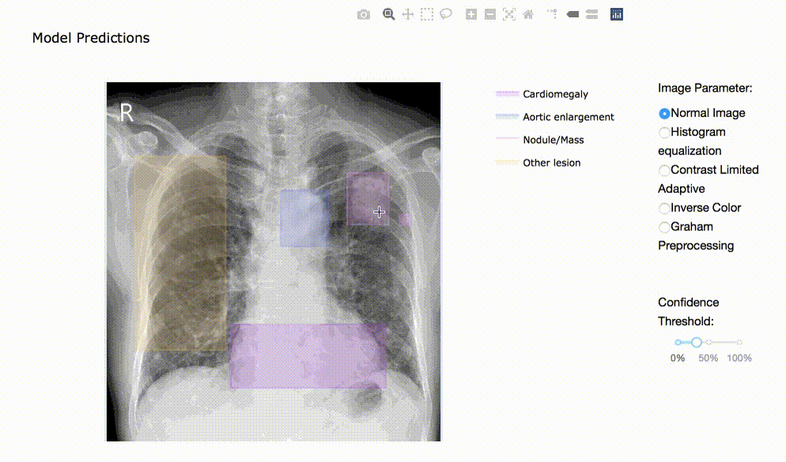

# abnormality-detection-x-ray
Chest X-ray Abnormalities Detection: Automatically localize and classify thoracic abnormalities from chest radiographs - Research Application - End-to-end prediction and inference pipeline  - Dash app to visualize result

